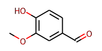

I assume most reading this blog post have also read and applied the [blog posts](https://rdkit.blogspot.com/2015/02/new-drawing-code.html) from Greg Landrum about 
RDKits "not so new anymore" drawing code.  While a lot has changed since that post, most notably that many of the convenience methods now also use this "new" drawing code, you may ask yourself why you should read another blog post about 2D depiction with the RDKit? In this post I will focus on creating 2D depictions for example for display in web applications from real-world legacy systems, system that have been feed with data for decades and went through multiple migrations possibly even between vendors and structure formats.

## Context

<<<<<<< HEAD
Or maybe you don't actually know that problem? In that case call yourself lucky! Issues with the structure drawings can arise due to conversions between formats and how the structures where normalized to begin with if at all. Proprietary formats like used in ChemDraw also store the style of the structure. This not only includes orientation of the structures but more importantly styling like label size, bond thickness and bond length are saved as well. When converting back these structures to open formats like mol, at least the bond length setting can be conserved via the coordinates and significantly differ from RDKits default bond length of 1.5. 

## Importance of the bond length

RDKits drawing depends on the correct bond length on coordinates level (not pixel level). The default or said otherwise expected value is `1.5`. If the bond length differs from the default, the structure will be drawn too small or too big and the atom labels will proportionally be too small or too big as well. This will lead to very ugly looking depictions. This can be made worse as different records will might have different bond length and hence each record will look a little more or less ugly.
=======
Or maybe you don't actually know that problem? In that case call yourself lucky! Issues with the structure drawings can arise due to conversions between formats and how the structures where normalized, if at all. Proprietary formats like cdx (ChemDraw) also store the style of the structure. This not only includes orientation of the structures but more importantly styling like label size, bond thickness and bond length. When converting back these structures to open formats like mol, at least the bond length setting can be conserved via the coordinates and significantly differ from RDKits default bond length of `1.5`. 

## Importance of the bond length

RDKits drawing depends on the correct bond length on coordinates level (not pixel level). The default or said otherwise expected value is `1.5`. If the bond length differs from the default, the structure will be drawn too small or too big and the atom labels will proportionally be too small or too big as well. This will lead to very ugly looking depictions. This can be made worse as different records might have different bond length and hence each record will look a little more or less ugly.
>>>>>>> 3bf7f6efb57cd2c4205715825a8d067321a72b50


This example isn't that terrible. The actual use-cases I observed due to this issue are unusable. This example however should be somewhat easy to reproduce.

## Scaling the bond length

<<<<<<< HEAD
The issue can be resolved by scaling the bond length to approximately the correct value of 1.5. I need to add that convenience functions like `MolToImage` fix the issue automatically at the cost of losing flexibility in controlling the drawing. If these functions are good enough, you don't need to worry about this problem.  Another option to easily fix the issue is to regenerate the 2D coordinates but that will destroy the original orientation of the drawing. The goal here is to show the molecules in the same orientation as they were originally drawn. Ok, now show me the code already! OK, here you go. This should be used in the context of a notebook.

```python
=======
The issue can be resolved by scaling the bond length to approximately the correct value of `1.5`. I need to add that convenience functions like `MolToImage` fix the issue automatically at the cost of losing flexibility in controlling the drawing. If these functions are good enough, you don't need to worry about this problem.  Another option to easily fix the issue is to regenerate the 2D coordinates but that can destroy the original orientation of the drawing. The goal here is to show the molecules in the same orientation as they were originally drawn. Ok, now show me the code already! OK, here you go. This should be used in the context of a notebook.


>>>>>>> 3bf7f6efb57cd2c4205715825a8d067321a72b50
import rdkit
from rdkit import Chem
from rdkit.Chem import AllChem
from rdkit.Chem.Draw import rdMolDraw2D
from IPython.display import SVG
import numpy as np
import math
import copy
rdkit.__version__
<<<<<<< HEAD
```
=======

>>>>>>> 3bf7f6efb57cd2c4205715825a8d067321a72b50


    '2020.03.1'

We will use Vanillin as example. The below molfile was created with ChemDraw using Structure to Name on a document with ACS Document 1996 style and then copied as molfile.


<<<<<<< HEAD
```python
=======

>>>>>>> 3bf7f6efb57cd2c4205715825a8d067321a72b50
molblock = """
  ChemDraw07272010352D

 11 11  0  0  0  0  0  0  0  0999 V2000
   -1.4289    0.8250    0.0000 O   0  0  0  0  0  0  0  0  0  0  0  0
    2.1434   -0.4125    0.0000 O   0  0  0  0  0  0  0  0  0  0  0  0
    1.4289   -0.8250    0.0000 C   0  0  0  0  0  0  0  0  0  0  0  0
    0.7145   -0.4125    0.0000 C   0  0  0  0  0  0  0  0  0  0  0  0
    0.0000   -0.8250    0.0000 C   0  0  0  0  0  0  0  0  0  0  0  0
   -0.7145   -0.4125    0.0000 C   0  0  0  0  0  0  0  0  0  0  0  0
   -1.4289   -0.8250    0.0000 O   0  0  0  0  0  0  0  0  0  0  0  0
   -2.1434   -0.4125    0.0000 C   0  0  0  0  0  0  0  0  0  0  0  0
   -0.7145    0.4125    0.0000 C   0  0  0  0  0  0  0  0  0  0  0  0
    0.0000    0.8250    0.0000 C   0  0  0  0  0  0  0  0  0  0  0  0
    0.7145    0.4125    0.0000 C   0  0  0  0  0  0  0  0  0  0  0  0
  2  3  2  0      
  3  4  1  0      
  4  5  1  0      
  5  6  2  0      
  6  7  1  0      
  7  8  1  0      
  6  9  1  0      
  1  9  1  0      
  9 10  2  0      
 10 11  1  0      
  4 11  2  0      
M  END
"""
vanillin = Chem.MolFromMolBlock(molblock)
<<<<<<< HEAD
```
=======

>>>>>>> 3bf7f6efb57cd2c4205715825a8d067321a72b50

We create a function for drawing an SVG image. This function can easily be expanded further to give more control over the drawing if that is needed. The function also makes use of the new `fixedBondLength`option. Albeit it might be confusing to mention this here, this option is strictly about bond length in screen space, eg. pixels and can be used to limit the size a molecule takes up on-screen. Setting this option prevents small molecules from looking huge due to taking up the full canvas which is an issue often in web applications in which structure images often have a fixed predefined space.


<<<<<<< HEAD
```python
=======

>>>>>>> 3bf7f6efb57cd2c4205715825a8d067321a72b50
def draw_molecule(mol, width=200, height=100, fixedBondLength=20):
    m = Chem.Draw.rdMolDraw2D.PrepareMolForDrawing(mol, kekulize=True, addChiralHs=True)
    drawer = Chem.Draw.rdMolDraw2D.MolDraw2DSVG(width, height)
    drawer.SetFontSize(0.75)       
    opts = drawer.drawOptions()        
    opts.bgColor = None
    opts.clearBackground = False
    opts.fixedBondLength = fixedBondLength

    drawer.DrawMolecule(m)
    drawer.FinishDrawing()
    svg = drawer.GetDrawingText() 
    return svg
<<<<<<< HEAD
```
=======

>>>>>>> 3bf7f6efb57cd2c4205715825a8d067321a72b50

Now we draw the molecule without any modifications, eg. with coordinates and hence bond length from the molfile. Due to the smaller bond length this will lead to a drawing with relatively large labels.


<<<<<<< HEAD
```python
SVG(draw_molecule(vanillin))
```
=======

SVG(draw_molecule(vanillin))

>>>>>>> 3bf7f6efb57cd2c4205715825a8d067321a72b50


#### Function for scaling the bond length

First a copy of the input is made. Then we calculate the average bond length  over all bonds. This is done because bond length can differ quiet a lot between bond depending on the type of structure. Hence just taking the first bond can lead to unexpected results. An optimization could be to sample a couple of bonds randomly if you deal with much bigger structures.

Then we calculate the ratio of the default bond length of `1.5` vs average bond length and transform the molecules x and y coordinates accordingly and return the scaled copy of the molecule.


<<<<<<< HEAD
```python
=======

>>>>>>> 3bf7f6efb57cd2c4205715825a8d067321a72b50
def scaleBondLength(mol):

    default_bond_length = 1.5 #rdkit default bond length
    
    m = copy.deepcopy(mol)
    
    bonds = m.GetBonds()

    if len(bonds) == 0:
        return mol

    total = 0
    for bond in bonds:

        ai = bond.GetBeginAtomIdx()
        aj = bond.GetEndAtomIdx()
        bl = AllChem.GetBondLength(mol.GetConformer(), ai, aj)
        if not math.isnan(bl):
            total += bl

    avg_bl = (total / len(bonds))
    if avg_bl > 0.0:

        bl_ratio = default_bond_length / avg_bl

        tm = np.zeros((4,4),np.double)
        for i in range(3): 
            tm[i,i] = bl_ratio

        AllChem.TransformMol(m,tm)
        return m
<<<<<<< HEAD
```
=======

>>>>>>> 3bf7f6efb57cd2c4205715825a8d067321a72b50

Now we scale the molecule and then draw it again. The image now looks correct.


<<<<<<< HEAD
```python
vs = scaleBondLength(vanillin)
```


```python
SVG(draw_molecule(vs))
```




That's it! With this scaling fix and the new `fixedBondLength` option one can now generate structure images which in my opinion are superior to commercial tools especially for usage in web applications.
=======

vs = scaleBondLength(vanillin)




SVG(draw_molecule(vs))



That's it! With this scaling fix and the new `fixedBondLength` option one can now generate structure images which in my opinion are equivalent if not superior to commercial tools especially for usage in web applications.
>>>>>>> 3bf7f6efb57cd2c4205715825a8d067321a72b50
